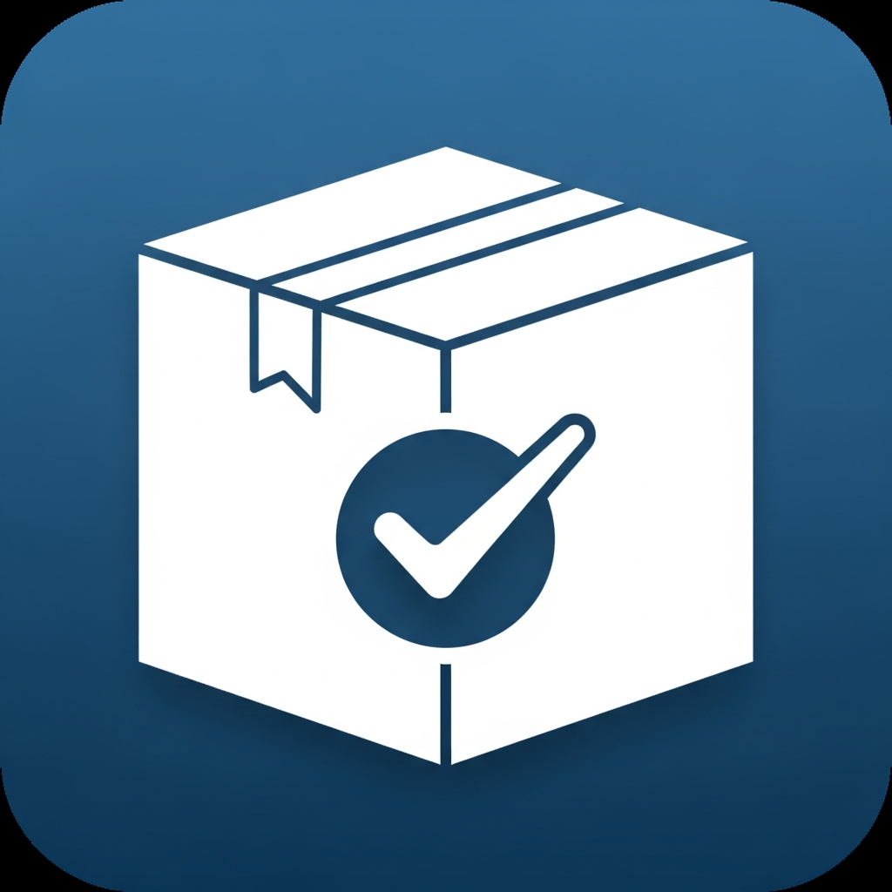

# Condo Encomendas Lite 


**Controle de encomendas para portaria — 100% offline, sem custos, sem cadastro.**

O app roda inteiramente no dispositivo. Nenhum dado sai do aparelho: não há servidor, não há nuvem, não há assinatura. Tudo que é registrado fica salvo localmente no celular/tablet da portaria.

---

## O que o app faz

- Registra a chegada de encomendas com foto, código e código de barras
- Notifica o morador via WhatsApp com uma mensagem personalizada e um código de retirada
- Confirma a entrega com **assinatura digital** ou **código de retirada**
- Mantém o histórico completo de entradas e saídas
- Gera relatórios semanais e permite exportar tudo em CSV
- Importa e exporta backup completo dos dados (JSON)

---

## Primeiros passos

### 1. Configure o condomínio
Acesse **Configurações** e preencha:
- Nome do condomínio (aparece na tela inicial)
- Logo (opcional, aparece na tela inicial)
- Modelo de mensagem WhatsApp (veja os campos disponíveis abaixo)

### 2. Cadastre os moradores
Acesse **Contatos** e adicione os moradores com:
- Nome completo
- Quadra/Bloco e Lote/Apartamento
- Número de WhatsApp (apenas DDD + número, ex: `11999999999`)
- E-mail (opcional)

Você também pode importar uma planilha CSV com todos os moradores de uma vez (veja o formato abaixo).

### 3. Registre encomendas
No **Dashboard**, toque em **Nova Encomenda** e preencha:
- Morador destinatário
- Foto da encomenda (opcional mas recomendado)
- Código de rastreio ou código de barras (obrigatório)

Ao salvar, o app gera automaticamente um **código de retirada** de 6 dígitos.
Obs: É possível apenas salvar ou salvar e enviar notificação, no segundo caso o app abre o WhatsApp já com a mensagem montada — basta enviar.
A mesma ação de notificar também fica disponível na tela de detalhes de encomenda, botão "Notificar"

---

## Dar baixa (confirmar entrega)

Quando o morador vem retirar a encomenda, abra a encomenda correspondente e toque em **Dar Baixa**. Há duas formas:

### Assinatura digital
O morador assina diretamente na tela do dispositivo. A assinatura aceita múltiplos traços — use quantos movimentos forem necessários para assinar. Toque em **Limpar** apenas se quiser apagar tudo e recomeçar.

### Código de retirada
O morador informa o código de 6 dígitos enviado pelo WhatsApp. O app valida o código automaticamente.

Após a confirmação, a encomenda muda para o status **Entregue** e o histórico é registrado com data, hora e prova de entrega.

---

## Telas do app

| Tela | O que faz |
|---|---|
| **Dashboard** | Visão geral: encomendas pendentes, recebidas hoje, entregues. Acesso rápido ao cadastro. |
| **Encomendas** | Lista completa com filtro por status (pendente/entregue) e por bloco. |
| **Contatos** | Diretório de moradores. Busca por nome ou unidade. |
| **Relatórios** | Gráfico semanal de entradas e saídas. Exportação em CSV. |
| **Configurações** | Nome do condomínio, logo, modelo WhatsApp, políticas de limpeza de dados. |

---

## Modelo de mensagem WhatsApp

Na tela de Configurações você pode personalizar o texto que é enviado ao morador. Use os campos entre `{{ }}` para inserir dados automaticamente:

| Campo | O que insere |
|---|---|
| `{{nome}}` | Nome do morador |
| `{{unidade}}` | Quadra/bloco e lote/apartamento |
| `{{codigo}}` | Código da encomenda |
| `{{codigo_retirada}}` | Código de 6 dígitos para retirada |
| `{{localizadores}}` | Códigos de barras da encomenda |
| `{{data}}` | Data e hora de chegada |

**Exemplo de mensagem:**
```
Olá, {{nome}}! Há uma encomenda aguardando retirada na portaria.
Código de retirada: {{codigo_retirada}}
Unidade: {{unidade}}
Data de chegada: {{data}}
```

---

## Importação de moradores via CSV

Para importar vários moradores de uma vez, prepare um arquivo `.csv` com as seguintes colunas:

```
nome,quadra_bloco,lote_ap_casa,whatsapp,endereco,email,observacoes
João Silva,Bloco A,101,11999990001,joao@email.com,,
Maria Souza,Quadra 3,42,11999990002,,,
```

- O separador pode ser vírgula (`,`) ou ponto-e-vírgula (`;`)
- A linha de cabeçalho é obrigatória
- Campos obrigatórios: `nome`, `quadra_bloco`, `lote_ap_casa`
- `whatsapp`: somente dígitos, formato **DDD + número** (10 ou 11 dígitos, sem código do país). Ex: `11999990001`
- `endereco`, `email` e `observacoes` são opcionais

Acesse **Contatos → Importar CSV** e selecione o arquivo.

---

## Backup e restauração

### Exportar backup
Em **Configurações → Exportar Backup**, o app gera um arquivo `.json` com todos os moradores, encomendas e configurações.

> 💡 **Sugestão:** crie uma pasta chamada `Backups Condo Encomendas` no Google Drive e salve os backups ali regularmente. Assim você garante acesso ao histórico em qualquer situação — troca de celular, reinstalação do app ou perda do dispositivo.

### Restaurar backup
Em **Configurações → Importar Backup**, selecione um arquivo `.json` exportado anteriormente. **Atenção: isso substitui todos os dados atuais.** Exporte um backup de segurança antes de importar.

### Limpeza de registros antigos
Em **Configurações**, você pode definir por quantas semanas manter registros de encomendas já entregues. O padrão é 12 semanas (máximo: 52 semanas / 1 ano). Use a função **Limpar Registros Antigos** para remover entradas acima desse limite e manter o app ágil.

### Limite recomendado de backup

Cada encomenda **com assinatura** ocupa aprox. **5–6 KB** no backup. Sem assinatura, menos de 1 KB.

| Volume | Situação |
|---|---|
| Até ~500 encomendas | Confortável — backup e restauração rápidos |
| 500–1.000 encomendas | Funcional — exportação pode demorar alguns segundos |
| Acima de 1.000 encomendas | Backup pesado — use "Limpar Registros Antigos" regularmente |

> 💡 Com 12 semanas de retenção e ~20 encomendas/dia, o volume fica em torno de 1.680 registros. Reduza o período de retenção se o app ficar lento.

> 💡 Exporte um backup regularmente para não perder dados em caso de troca de dispositivo ou reinstalação do app.

---

## Exportação de relatórios

Na tela **Relatórios**, toque em **Exportar CSV** para gerar uma planilha com o histórico de todas as encomendas. O arquivo inclui:

- Data e hora de chegada
- Morador e unidade
- Código de rastreio
- Data e hora de entrega
- Método de confirmação (assinatura ou código)

---

## Privacidade e dados

- **Nenhum dado é enviado para servidores externos.** Tudo fica no armazenamento local do dispositivo.
- As mensagens de WhatsApp são abertas no próprio aplicativo WhatsApp instalado — o app não envia mensagens automaticamente.
- Fotos de encomendas e assinaturas ficam salvas apenas no dispositivo.
- O backup exportado contém dados pessoais dos moradores — guarde-o com cuidado.

---

## Perguntas frequentes

**O app funciona sem internet?**
Sim. Toda a operação é offline. A internet é usada apenas quando você abre o WhatsApp para enviar a notificação ao morador.

**Posso usar em mais de um dispositivo?**
O app não sincroniza entre dispositivos automaticamente. Para usar em um segundo aparelho, exporte o backup no primeiro e importe no segundo. A partir daí, os dois ficam independentes.

**O que acontece se eu desinstalar o app?**
Os dados são apagados junto com o app. Faça backup regularmente antes de qualquer atualização ou troca de dispositivo.

**Posso usar em tablet?**
Sim. O app funciona em Android (celular e tablet). A tela de assinatura é mais confortável em telas maiores.

**O código de retirada é seguro?**
O código é gerado aleatoriamente com 6 dígitos e é único por encomenda. Ele só é válido para a encomenda específica para a qual foi gerado.

---

## Suporte

Este é um app de código aberto, sem suporte comercial. Para dúvidas ou sugestões, consulte o repositório do projeto.
